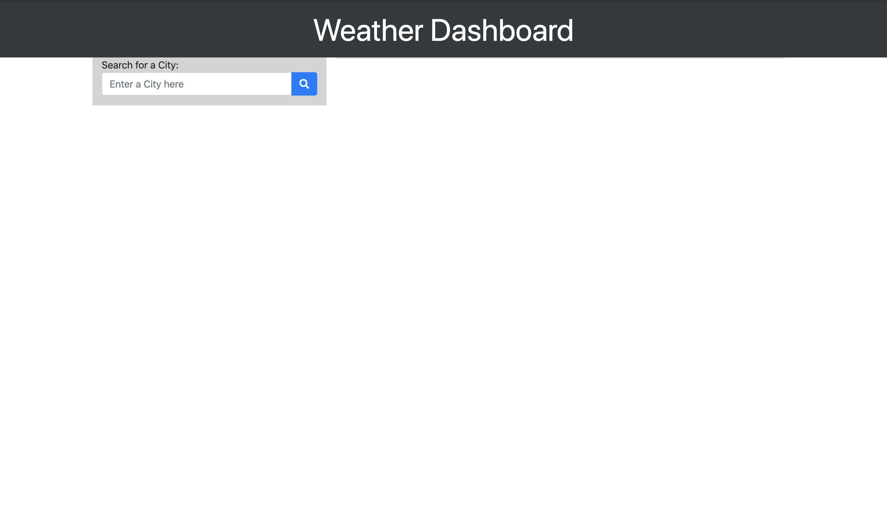

# Unit-06-Server-Side-APIs-Homework-Weather-Dashboard

Search for a city you would like to know the weather of. Powered by jQuery via Openweather API, each city searched for will stay populated in the viewport until page is refreshed. 

See the deployed application here:

 https://tcauley91.github.io/Unit-06-Server-Side-APIs-Homework-Weather-Dashboard/.